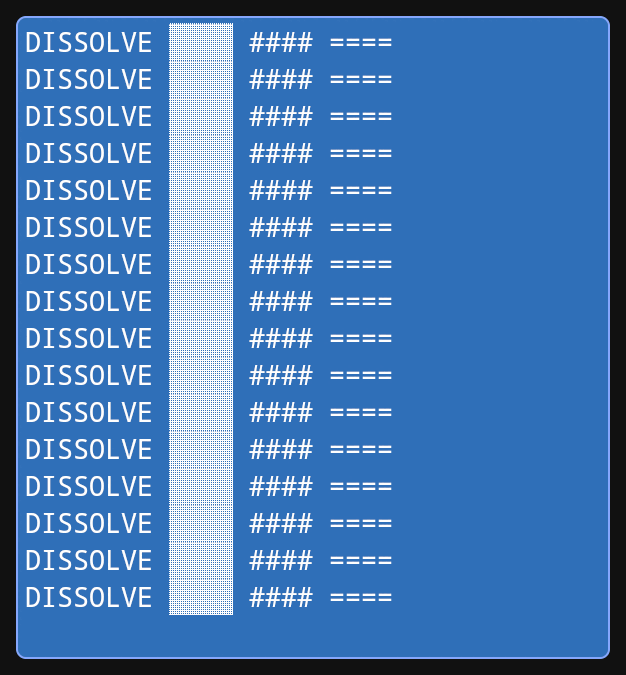

# hypr-dissolve

Плагин Hyprland: при закрытии окно рассыпается на пиксели и улетает вверх —
как анимация удаления сообщения в Telegram.



## Что делает

Перехватывает `IHyprRenderer::renderFadeouts` и для закрывающихся окон
подменяет штатную отрисовку снимка своей: снимок режется на сетку блоков, и
каждый блок отдельным квадом отрывается и улетает по своей траектории.

Так же рассыпаются **слои** — меню на `layer-shell`, то есть rofi и всё, что
на нём построено. Но только те, чьё имя перечислено в `layer_namespaces`: слой
— это ещё и панель, и уведомления, и обои, а рассыпающееся при каждом чихе
уведомление быстро надоедает. По умолчанию в списке один `rofi`.

Попапы не трогаются никогда.

## Требования

- Hyprland **0.56.2** (плагин привязан к ABI конкретной сборки, см. ниже)
- заголовки Hyprland: пакет `hyprland` на Arch ставит их в `/usr/include/hyprland`
- `cmake`, `g++` с поддержкой C++26

## Сборка и установка

```sh
./install.sh
```

Скрипт собирает `.so` и печатает строку, которую надо добавить в
`~/.config/hypr/hyprland.conf`. Сам конфиг он не трогает.

Ручной вариант:

```sh
cmake -S . -B build -DCMAKE_BUILD_TYPE=Release
cmake --build build -j$(nproc)
hyprctl plugin load ~/Projects/hypr-dissolve/build/hypr-dissolve.so
```

Чтобы плагин поднимался вместе с сессией, в `hyprland.conf`:

```
plugin = /home/bogdan/Projects/hypr-dissolve/build/hypr-dissolve.so
```

## Конфиг: .conf и Lua

Плагин работает с обоими менеджерами конфига Hyprland. В Lua настройки
задаются через общий `hl.config`, а не присваиванием:

```lua
hl.plugin.load("/home/…/hypr-dissolve/build/hypr-dissolve.so")

hl.config({
    plugin = {
        dissolve = {
            key_leak_fix = 1,
            dust_life    = 0.35,
        },
    },
})
```

`hl.plugin.dissolve.key_leak_fix = 1` **не работает**: `hl.plugin.<имя>` — не
таблица настроек, а пространство Lua-функций плагина, и присваивание падает с
`attempt to index a nil value`. Ошибка в Lua-конфиге роняет весь файл, поэтому
Hyprland уходит в аварийный режим — с рабочим `SUPER + Q` и текстом ошибки
поверх экрана. Из системы это не выкидывает, но конфиг не применяется целиком.

Внутри плагина это стоило двух правок, обе обязательные для Lua:

- настройки регистрируются через `addConfigValueV2`, а не через устаревший
  `addConfigValue` — старый API идёт через hyprlang, и в Lua-режиме значения
  плагина просто не появляются;
- читаются они через `IConfigManager::getConfigValue`, а не через шаблон
  `CConfigValue` — последний рассчитан на hyprlang и под Lua **валит
  композитор ассертом** на первом же кадре.

## ⚠️ Про обновления Hyprland

Плагин работает с внутренними структурами Hyprland, а их разложение меняется
между версиями. **Каждое обновление пакета `hyprland` требует пересборки
плагина.**

Плагин сам сверяет версию и отказывается грузиться при расхождении — вместо
того чтобы работать и уронить сессию. Если после обновления системы анимация
пропала и всплыло уведомление про версию, выполните `./install.sh` заново.

Падение плагина уносит весь композитор со всеми открытыми окнами, поэтому любые
правки кода проверяйте во вложенном Hyprland (`test/`), а не в рабочей сессии.

**Никогда не держите две копии плагина загруженными одновременно.** Это два
набора хуков на одни и те же функции, и композитор падает со всеми окнами —
проверено на собственной сессии. `install.sh` выгружает все свои копии до
загрузки новой и отказывается работать, если в сессии остался экземпляр,
которого он не знает. Список загруженного — `hyprctl plugin list`.

## Настройки

Все ключи необязательные, значения ниже — по умолчанию. Размеры задаются в
логических пикселях, плагин сам пересчитывает их на scale монитора.

```
plugin {
    dissolve {
        enabled    = 1     # 0 — выключить, вернётся штатная анимация
        block_size = 4     # сторона «пикселя» распада
        rise       = 200   # на сколько блоки улетают вверх
        spread     = 0.55  # разброс скоростей блоков, 0..1
        drift      = 0.35  # боковой разброс, доля от rise
        wave       = 0.55  # 0 — распад равномерно по всей площади,
                           # 1 — строгий фронт сверху вниз
        dust_life  = 0.35  # сколько блок живёт после отрыва, 0.05..0.95
        lead       = 1.15  # опережение распада, чтобы успеть догореть

        layers            = 1        # рассыпать ли слои вообще
        layer_namespaces  = rofi     # чьи слои рассыпать, через запятую
    }
}
```

`layer_namespaces` сравнивается по подстроке, без учёта регистра: `rofi` ловит
и `rofi`, и гипотетический `my-rofi-menu`. Имя работающего слоя показывает
`hyprctl layers` — колонка `namespace`. У панели это обычно `bar-0` или
`waybar`, у уведомлений — что-то вроде `notifications-window`.

`dust_life` и разброс моментов отрыва делят между собой одну шкалу: диапазон
порогов равен `1 - dust_life`. Поэтому большой `dust_life` даёт длинный шлейф у
каждого блока, но более плоскую волну, а маленький — резкие искры и заметный
фронт. Крайние значения обрезаются, чтобы распад всегда успевал догореть до
конца анимации.

### Длительность

Плагин не заводит своего таймера — он берёт прогресс из альфы штатной анимации
`fadeOut`. Хотите медленнее и зрелищнее:

```
animations {
    animation = fadeOut, 1, 15, default
    animation = windowsOut, 1, 15, default, popin 100%
}
```

`15` — это 1.5 секунды. По умолчанию `fadeOut` наследует скорость от `global`
(обычно 8, то есть 0.8 с): распад успевает пройти целиком, но мелькает.

**Вторую строку не пропускайте.** `windowsOut` управляет геометрией
закрывающегося окна. Если оставить её короткой, она отработает раньше — окно
замрёт (или уедет) на середине распада, пока пиксели ещё летят. `popin 100%`
означает «не сжимать»: окно стоит на месте, улетают только пиксели — как в
образце из Telegram.

**Для слоёв нужны свои две строки.** rofi живёт не на `fadeOut`, а на
собственной ветке; если её не удлинить, меню будет рассыпаться за прежние
0.8 с, пока окна рассыпаются за 1.5:

```
animations {
    animation = fadeLayersOut, 1, 15, default
    animation = layersOut, 1, 15, default, popin 100%
}
```

Все четыре ветки касаются исключительно закрытия. Переключение рабочих столов
и появление окон идут от других веток и не затрагиваются.

Подобрать значение можно без правки файла и без перезагрузки:

```bash
hyprctl keyword animation 'fadeOut,1,20,default'
hyprctl keyword animation 'windowsOut,1,20,default,popin 100%'
```

`hyprctl reload` вернёт то, что записано в конфиге.

## Утечка зажатой клавиши (`key_leak_fix`)

Отдельная от анимации починка, по умолчанию **выключена**.

По протоколу `wl_keyboard.enter` несёт массив клавиш, зажатых на момент
получения фокуса. Это состояние, а не события — но не все клиенты так его
читают. Firefox видит в массиве `Escape` и обрабатывает как нажатие.

Отсюда неочевидный баг: закрываете rofi по `Esc` поверх полноэкранного
видео — и видео выходит из полноэкранного режима. Фокус уходит вниз раньше,
чем клавишу отпустили, и `Esc` достаётся тому, кто оказался под меню. Своё
приложение можно научить закрываться на отпускании, но rofi и прочие чужие
бинарники так не поправить, поэтому массив чистится на стороне композитора.

```
plugin {
    dissolve {
        key_leak_fix   = 1     # 0 по умолчанию
        key_leak_codes = 1     # evdev-коды через запятую, 1 = KEY_ESC
    }
}
```

Чистятся **только перечисленные коды**, а не весь массив: играм и редакторам
список зажатых клавиш нужен по делу — например, клавиша движения, зажатая при
возврате фокуса. Модификаторы идут отдельным путём (`sendMods`) и фильтром не
затрагиваются вообще, как и обычные нажатия: `Esc` внутри приложения работает
как работал.

### Почему одного фильтра массива мало

Вычистить клавишу из `enter` — это половина дела. Следом клиенту приезжает
**отпускание** той же клавиши, и Firefox складывает одно с другим: нажатия он
не видел, но считает, что оно было. Фуллскрин слетает ровно так же.

Поэтому плагин запоминает, что именно он вырезал у каждого клиента, и глотает
первое же отпускание для этих кодов. Настоящее нажатие сбрасывает пометку —
клиент теперь держит клавишу честно и своё отпускание получит.

Иначе говоря: если мы сказали клиенту «ничего не зажато», мы не имеем права
слать ему отпускание того, чьего нажатия он не видел.

### Как это проверялось

`/dev/uinput` создаёт виртуальную клавиатуру и держит `Esc` нажатым, пока rofi
закрывается (`test/holdkey.py`). `hyprctl dispatch sendkeystate` для этого не
годится — он синтезирует событие мимо списка зажатых клавиш композитора, и
массив приходит пустым независимо от того, есть баг или нет.

Состояние Firefox читается машинно, без скриншотов: `test/fstest.html`
дублирует полноэкранный режим и счётчики `keydown`/`keyup` в заголовок окна, а
заголовок виден в `hyprctl clients`. Замеры на живой сессии:

| | до `Esc` | после `Esc` |
|---|---|---|
| фикс выключен | `FS=FULL` | `FS=WIN` — фуллскрин слетел |
| фикс включён | `FS=FULL` | `FS=FULL` — выжил |

Там же видно, что страница не получает `keydown` вовсе — только `keyup`.
Отсюда и вывод, что дело в паре «массив при фокусе + отпускание».

## Чего плагин НЕ делает

- **Не работает на скрытии спец-воркспейса.** Когда окно уезжает в
  `special:`, оно не закрывается — оно живо, просто не показано. Это другой
  путь рендера, снимка там нет. Для btop по SUPER+Ё распад будет только при
  настоящем закрытии (`Ctrl+C` или `Ctrl+Shift+W`), но не по `Esc`.
- **Панель и уведомления не рассыпаются** — и это не недоделка, а значение по
  умолчанию: в `layer_namespaces` только `rofi`. Захотите иначе — допишите их
  имена, но учтите, что уведомления гаснут по десятку раз на дню.
- **Попапы не рассыпаются вообще.** Выпадающие меню внутри приложений идут
  мимо плагина, отключить это нечем.
- **`key_leak_fix` не лечит клиента, а только не даёт ему повода.** Если
  приложение выходит из полноэкранного режима по другой причине, фильтр
  клавиш не поможет.
- Эффекты слоя (блюр под ним, скругление) при распаде не воспроизводятся:
  плагин рисует снимок своим шейдером, а не штатным путём. Заметно это разве
  что на полупрозрачном меню поверх пёстрых обоев.

## Отладка

```sh
# поднять вложенный Hyprland с плагином (рабочая сессия не пострадает)
./test/run-nested.sh /tmp/dissolve

# снять покадрово закрытие окна и закрытие слоя (rofi)
./test/capture.sh       /tmp/dissolve
./test/capture-layer.sh /tmp/dissolve
```

Скрипты печатают профиль размеров кадров. **Размер PNG — самый дешёвый признак
того, что эффект вообще идёт:** целое окно это большая однородная заливка, она
жмётся отлично; распад даёт шум, и файл распухает вдвое-втрое; в конце пустой
экран — снова мелкий. Ровный профиль означает, что распад не включился, и
разглядывать кадры бессмысленно.

Грабли, на которых легко потерять вечер:

- **Проверяйте, какой `.so` реально в памяти:**
  `grep hypr-dissolve /proc/$(pidof Hyprland)/maps`. `dlopen` различает
  библиотеки по пути, и пока прежний образ не выгрузился, повторная загрузка
  того же пути вернёт **старую** сборку, а `hyprctl` ответит `ok`. Из-за этого
  легко часами отлаживать код, которого в сессии нет. `install.sh` обходит это,
  загружая копию под уникальным именем.
- **`pkill -f` совпадает с собственной командной строкой** и убивает сам
  скрипт. Для процессов с известным именем — `pkill -x`.
- **Вложенному Hyprland нужен `WAYLAND_DISPLAY`.** Без него он падает с
  «could not connect to wayland server», и это легко списать на плагин.
  `run-nested.sh` подставляет сокет родителя сам.
- **Вложенный экземпляр не всегда создаёт окно вывода**: под логиндом, который
  уже держит сеат, DRM-бэкенд отваливается, а wayland-бэкенд в неинтерактивном
  окружении иногда застревает до создания вывода. Без вывода нет рендера и
  снимать нечего. `run-nested.sh` в этом случае делает виртуальный вывод
  (`hyprctl output create headless`).
